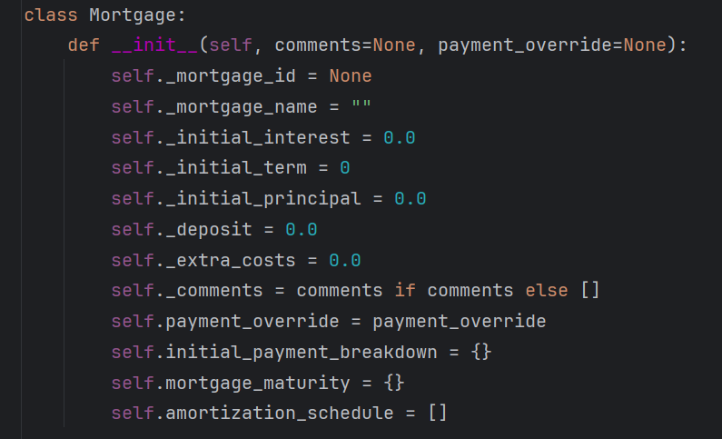

# Change Request

## Title
Entire layout for displaying the main page.

## Requester Information
- **Name:** Katherine Mulder

## Date
14/05/2024

## Change Description
For the programming part, my logical thinking differs from our original design. I will break down the programming add one more class which is the mortgage_monitor to represent the outcome.
The original design consists of three class diagrams: users, mortgage, and transaction. The wireframe for the index page displays all the data in a table layout, matching the Excel spreadsheet details.
In my design, I have incorporated more classes into my programming:
- **Mortgage:** 
- **Transaction:**  financial transactions related to mortgages, such as payments, disbursements, or fees.
- **Mortgage_monitor:** Main class overseeing the system.
- **User:**
- **AnalysisPeriod:** This class represents the time period
- **App:** handle interactions with the web interface
overall: 
- user - 
I would like to represent the design differently than the original wireframe just the index page and the functionality remains the same.

## Scope
This change request focuses on updating the appearance and layout of our web application and programming class structure. It involves rearranging elements like menus, page structures, colors, fonts, and overall design to enhance the user experience without altering functionality.

## Proposed Solution
- Rearranging and resizing elements for better usability.
- Ensuring the design looks good.
- Updating style and code files to reflect the changes.

## Rationale
- Make the app easier to use.
- Improve its visual appeal.
- Improve clean code.
- Keep up with current design standards.

## Impact Assessment
- As a junior developer, there is a risk that I may encounter challenges in implementing the changes, which could impact the project's progress and result in delays. This may lead to the client not receiving the ideal solution within the expected timeframe.
- The proposed changes may require more time for implementation due to the need for additional development and testing efforts.
- Users may need a bit of guidance.
- It will need to establish a process for gathering feedback from users
after implementation to identify any impacts or issues.

## Attachments

